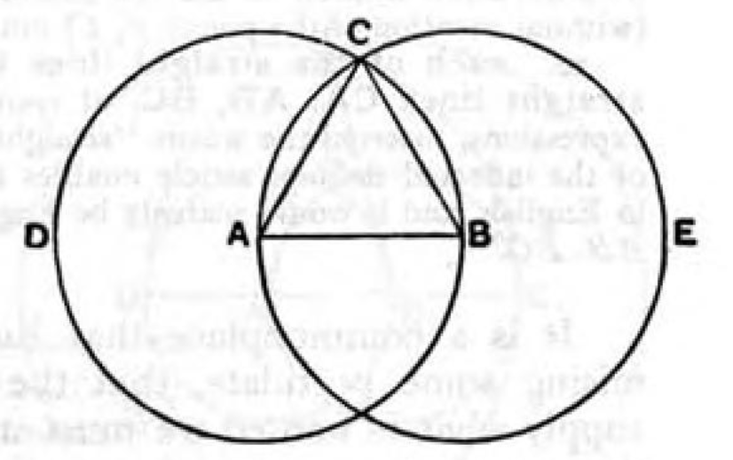
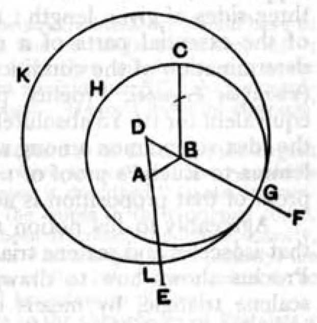

# THE ELEMENTS OF EUCLID
## BOOK A’
### DEFINITIONS: 

A POINT IS THAT WHICH
HAS NO PART. A LINE IS BREADTHLESS
LENGTH. THE EXTREMITIES OF A LINE
ARE POINTS. A STRAIGHT LINE IS A LINE
WHICH LIES EVENLY WITH THE POINTS
ON ITSELF. A SURFACE IS THAT WHICH
HAS LENGTH AND BREADTH ONLY. THE
EXTREMITIES OF A SURFACE ARE LINES. A
PLANE SURFACE IS A SURFACE WHICH
LIES EVENLY WITH THE STRAIGHT LINES
ON ITSELF. A PLANE ANGLE IS THE
INCLINATION TO ONE ANOTHER OF
TWO LINES IN A PLANE WHICH MEET
ONE ANOTHER AND DO NOT LIE IN A
STRAIGHT LINE. AND WHEN THE LINES
CONTAINING THE ANGLE ARE STRAIGHT,
THE ANGLE IS CALLED RECTILINEAL.
WHEN A STRAIGHT LINE SET UP ON A
STRAIGHT LINE MAKES THE ADJACENT
ANGLES EQUAL TO ONE ANOTHER, EACH
OF THE EQUAL ANGLES IS RIGHT, AND
THE STRAIGHT LINE STANDING ON THE
OTHER IS CALLED A PERPENDICULAR TO
THAT ON WHICH IT STANDS. AN OBTUSE
ANGLE IS AN ANGLE GREATER THAN A
RIGHT ANGLE. AN ACUTE ANGLE IS AN
ANGLE LESS THAN A RIGHT ANGLE. A
BOUNDARY IS THAT WHICH IS AN
EXTREMITY OF ANYTHING. A FIGURE IS
THAT WHICH IS CONTAINED BY ANY
BOUNDARY OR BOUNDARIES. A CIRCLE
IS A PLANE FIGURE CONTAINED BY ONE
LINE SUCH THAT ALL THE STRAIGHT
LINES FALLING UPON IT FROM ONE
POINT AMONG THOSE LYING WITHIN
THE FIGURE ARE EQUAL TO ONE
ANOTHER; AND THE POINT IS CALLED
THE CENTRE OF THE CIRCLE. A DIAMETER
OF THE CIRCLE IS ANY STRAIGHT LINE
DRAWN THROUGH THE CENTRE AND
TERMINATED IN BOTH DIRECTIONS BY
THE CIRCUMFERENCE OF THE CIRCLE,
AND SUCH A STRAIGHT LINE ALSO
BISECTS THE CIRCLE. A SEMICIRCLE IS THE
FIGURE CONTAINED BY THE DIAMETER
AND THE CIRCUMFERENCE CUT OFF BY
IT. AND THE CENTRE OF THE SEMICIRCLE
IS THE SAME AS THAT OF THE CIRCLE.
RECTILINEAL FIGURES ARE THOSE WHICH
ARE CONTAINED BY STRAIGHT LINES,
TRILATERAL FIGURES BEING THOSE
CONTAINED BY THREE, QUADRILATERAL
THOSE CONTAINED BY FOUR, AND
MULTILATERAL THOSE CONTAINED BY
MORE THAN FOUR STRAIGHT LINES. OF
TRILATERAL FIGURES, AN EQUILATERAL
TRIANGLE IS THAT WHICH HAS ITS THREE
SIDES EQUAL, AN ISOSCELES TRIANGLE
THAT WHICH HAS TWO OF ITS SIDES
ALONE EQUAL, AND A SCALENE
TRIANGLE THAT WHICH HAS ITS THREE
SIDES UNEQUAL. FURTHER, OF
TRILATERAL FIGURES, A RIGHT-ANGLED
TRIANGLE IS THAT WHICH HAS A RIGHT
ANGLE, AN OBTUSE-ANGLED TRIANGLE
THAT WHICH HAS AN OBTUSE ANGLE,
AND AN ACUTEANGLED TRIANGLE
THAT WHICH HAS ITS THREE ANGLES
ACUTE. OF QUADRILATERAL FIGURES, A
SQUARE IS THAT WHICH IS BOTH
EQUILATERAL AND RIGHT-ANGLED; AN
OBLONG THAT WHICH IS RIGHT-ANGLED
BUT NOT EQUILATERAL; A RHOMBUS
THAT WHICH IS EQUILATERAL BUT NOT
RIGHT-ANGLED; AND A RHOMBOID
THAT WHICH HAS ITS OPPOSITE SIDES AND
ANGLES EQUAL TO ONE ANOTHER BUT IS
NEITHER EQUILATERAL NOR RIGHT-
ANGLED. AND LET QUADRILATERALS
OTHER THAN THESE BE CALLED TRAPEZIA.
PARALLEL STRAIGHT LINES ARE STRAIGHT
LINES WHICH, BEING IN THE SAME
PLANE AND BEING PRODUCED
INDEFINITELY IN BOTH DIRECTIONS, DO
NOT MEET ONE ANOTHER IN EITHER
DIRECTION.

### PROPOSITIONS:

#### A’:

ON A GIVEN FINITE
STRAIGHT LINE TO CONSTRUCT AN
EQUILATERAL TRIANGLE. LET AB BE THE
GIVEN FINITE STRAIGHT LINE. THUS IT IS
REQUIRED TO CONSTRUCT AN
EQUILATERAL TRIANGLE ON THE
STRAIGHT LINE AB. WITH CENTRE A AND
DISTANCE AB LET THE CIRCLE BCD BE
DESCRIBED; AGAIN, WITH CENTRE B AND
DISTANCE BA LET THE CIRCLE ACE BE
DESCRIBED; [POST. 3] AND FROM THE
POINT C, IN WHICH THE CIRCLES CUT
ONE ANOTHER, TO THE POINTS A, B LET
THE STRAIGHT LINES CA, CB BE JOINED.
NOW, SINCE THE POINT A IS THE CENTRE
OF THE CIRCLE CDB, AC IS EQUAL TO AB.
AGAIN, SINCE THE POINT B IS THE
CENTRE OF THE CIRCLE CAE, BC IS EQUAL
TO BA. BUT CA WAS ALSO PROVED EQUAL
TO AB; THEREFORE EACH OF THE STRAIGHT
LINES CA, CB IS EQUAL TO AB. AND
THINGS WHICH ARE EQUAL TO THE SAME
THING ARE ALSO EQUAL TO ONE
ANOTHER; [C.N. 1] THEREFORE CA IS ALSO
EQUAL TO CB. THEREFORE THE THREE
STRAIGHT LINES CA, AB, BC ARE EQUAL
TO ONE ANOTHER. THEREFORE THE
TRIANGLE ABC IS EQUILATERAL; AND IT
HAS BEEN CONSTRUCTED ON THE GIVEN
FINITE
STRAIGHT LINE
AB. (BEING)
WHAT IT WAS
REQUIRED TO
DO.

#### B’

TO PLACE AT A
GIVEN POINT (AS AN EXTREMITY) A
STRAIGHT LINE EQUAL TO A GIVEN
STRAIGHT LINE. LET A BE THE GIVEN
POINT, AND BC THE GIVEN STRAIGHT
LINE. THUS IT IS REQUIRED TO PLACE AT
THE POINT A (AS AN EXTREMITY) A
STRAIGHT LINE EQUAL TO THE GIVEN
STRAIGHT LINE BC. FROM THE POINT A
TO THE POINT B LET THE STRAIGHT LINE
AB BE JOINED; AND ON IT LET THE
EQUILATERAL TRIANGLE DAB BE
CONSTRUCTED. LET THE STRAIGHT LINES
AE, BF BE PRODUCED IN A STRAIGHT LINE
WITH DA, DB; WITH CENTRE B AND
DISTANCE BC LET THE CIRCLE CGH BE
DESCRIBED; AND AGAIN, WITH CENTRE D
AND DISTANCE DG LET THE CIRCLE GKL
BE DESCRIBED. THEN, SINCE THE POINT B
IS THE CENTRE OF THE CIRCLE CGH, BC IS
EQUAL TO BG. AGAIN, SINCE THE POINT
D IS THE CENTRE OF THE CIRCLE GKL, DL
IS EQUAL TO DG. AND IN THESE DA IS
EQUAL TO DB; THEREFORE THE
REMAINDER AL IS EQUAL TO THE
REMAINDER BG. BUT BC WAS ALSO
PROVED EQUAL TO BG; THEREFORE EACH
OF THE STRAIGHT LINES AL, BC IS EQUAL
TO BG. AND THINGS WHICH ARE EQUAL
TO THE SAME THING ARE ALSO EQUAL TO
ONE ANOTHER; THEREFORE AL IS ALSO
EQUAL TO BC.
THEREFORE AT
THE GIVEN
POINT A THE
STRAIGHT LINE
AL IS PLACED
EQUAL TO THE
GIVEN STRAIGHT
LINE BC. (BEING)
WHAT IT WAS
REQUIRED TO DO.